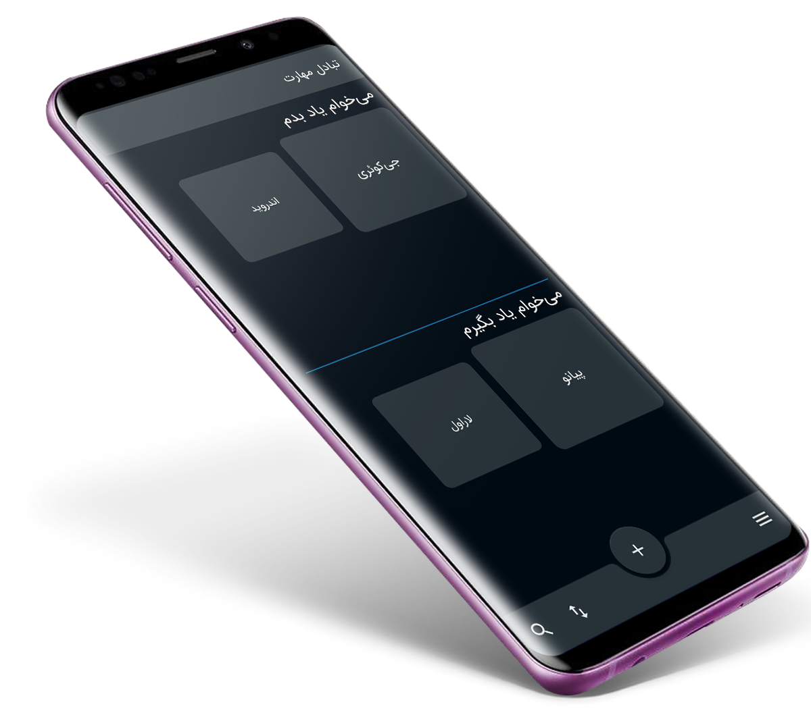

# Android client for Mahadel project

**Download APK**
[https://mahadel.ir/app/mahadel_ir.apk](https://mahadel.ir/app/mahadel_ir.apk)

**Requirements**
- Android Studio 3.4 Canary 8
- JDK 8
- Android SDK Build tools 28.0.3
- Supports API Level +17
- Support libraries with androidx v1.0.0

**Highlights**
- Use Material Design 2
- Sign up with Google account
- Support two language. English & Persian
- Support multiple theme
- Use locale Database

**Libraries & Dependencies**
- [Support libraries]: appcompat / recyclerview / constraintlayout
- [Material Design 2]: MaterialCardView / MaterialButton / Bottom App Bars
- [Play Services Auth]: use for sign up with Google account
- [FastAdapter]: The bullet proof, fast and easy to use adapter library, which minimizes developing time to a fraction
- [AndroidUtilCode]: is a powerful & easy to use library for Android. 
- [Calligraphy3]: Custom fonts in Android the easy way
- [CardSlider]: Cardslider is a material design UI controller that allows you to swipe through cards with pictures and accompanying descriptions.
- Square [Retrofit] / [Okhttp] / [Logging-Interceptor]
- [Glide]: An image loading and caching library for Android focused on smooth scrolling
- [CircularImageView] Create circular ImageView in Android in the simplest way possible.
- Firebase Core / Crashlytics / Messaging
- [ButterKnife]: Bind Android views and callbacks to fields and methods.

# License

    Copyright 2018 Behrouz Khezry

    Licensed under the Apache License, Version 2.0 (the "License");
    you may not use this file except in compliance with the License.
    You may obtain a copy of the License at

       http://www.apache.org/licenses/LICENSE-2.0

    Unless required by applicable law or agreed to in writing, software
    distributed under the License is distributed on an "AS IS" BASIS,
    WITHOUT WARRANTIES OR CONDITIONS OF ANY KIND, either express or implied.
    See the License for the specific language governing permissions and
    limitations under the License.
    
[Support libraries]: https://developer.android.com/jetpack/androidx/
[Material Design 2]: https://material.io/develop/android/
[Play Services Auth]: https://developers.google.com/android/guides/setup
[FastAdapter]: https://github.com/mikepenz/FastAdapter
[AndroidUtilCode]: https://github.com/Blankj/AndroidUtilCode
[Calligraphy3]: https://github.com/InflationX/Calligraphy
[CardSlider]: https://github.com/Ramotion/cardslider-android
[Retrofit]: https://github.com/square/retrofit
[Okhttp]: https://github.com/square/okhttp
[Logging-Interceptor]: https://github.com/square/okhttp/tree/master/okhttp-logging-interceptor
[Glide]: https://github.com/bumptech/glide
[CircularImageView]: https://github.com/lopspower/CircularImageView
[ButterKnife]: https://github.com/JakeWharton/butterknife
